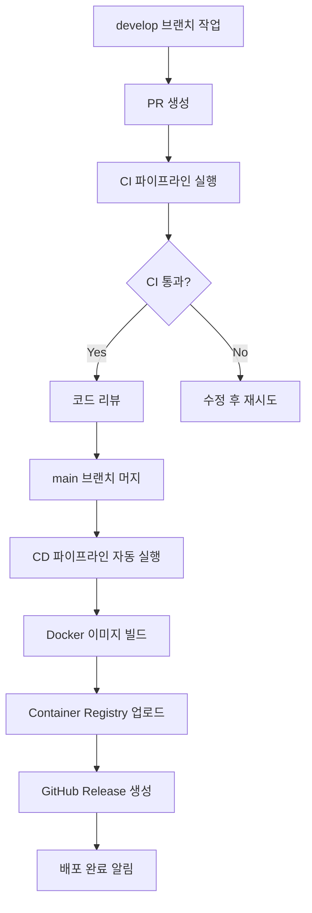

# 🎉 CD 워크플로우 구축 (현재 구현 중)

## 📋 완성된 파일 목록

### 1. GitHub Codespaces 설정
- `.devcontainer/devcontainer.json` - Codespaces 환경 설정
- `.devcontainer/setup.sh` - 자동 초기화 스크립트
- `.env.codespaces` - Codespaces 최적화 환경 변수
- `docker-compose.codespaces.yml` - Codespaces용 Docker Compose

### 2. CD 파이프라인
- `.github/workflows/cd.yml` - 배포 자동화 워크플로우
- `scripts/deploy-codespaces.sh` - Codespaces 배포 스크립트

### 3. 문서
- `CD_SETUP_COMPLETE.md` 

---

## 🚀 다음 단계 (팀원용 가이드)

### 1단계: GitHub Codespaces에서 테스트

1. **Codespaces 생성**
   ```bash
   # GitHub 저장소에서
   Code → Create codespace on main
   ```

2. **자동 설정 대기**
   - `.devcontainer/setup.sh`가 자동 실행됩니다
   - Java 21, Node.js 20 설치
   - 의존성 설치 및 Docker 서비스 시작

3. **배포 스크립트 실행**
   ```bash
   # Codespaces 터미널에서
   chmod +x scripts/deploy-codespaces.sh
   ./scripts/deploy-codespaces.sh
   ```

4. **서비스 확인**
   - 포트 탭에서 각 서비스 확인
   - Frontend: http://localhost:3000
   - Backend: http://localhost:8080
   - API 문서: http://localhost:8080/swagger-ui.html

### 2단계: CI/CD 파이프라인 테스트

1. **develop 브랜치에서 PR 생성** (CI 테스트)
   ```bash
   git checkout develop
   git pull origin develop
   git checkout -b feature/test-ci-cd
   # 간단한 변경사항 추가
   git add .
   git commit -m "test: CI/CD 파이프라인 테스트"
   git push origin feature/test-ci-cd
   # GitHub에서 PR 생성
   ```

2. **main 브랜치에 머지** (CD 테스트)
   - PR이 승인되고 CI 통과 후
   - main 브랜치로 머지
   - CD 파이프라인 자동 실행 확인

---

## 🔧 CD 파이프라인 기능

### 자동 실행되는 작업들

1. **보안 스캔** - 코드 및 의존성 취약점 검사
2. **Docker 이미지 빌드** - 백엔드/프론트엔드 이미지 생성
3. **GitHub Container Registry 업로드** - 이미지 저장
4. **GitHub Release 생성** - 버전 태그 및 릴리즈 노트
5. **배포 아티팩트 생성** - 배포용 파일들 패키징
6. **Slack 알림** - 배포 완료 알림 (설정 시)

### 생성되는 Docker 이미지

- `ghcr.io/YOUR_ORG/YOUR_REPO/backend:latest`
- `ghcr.io/YOUR_ORG/YOUR_REPO/frontend:latest`

---

## ⚙️ 환경 변수 설정 (중요!)

### GitHub Repository Secrets 설정 필요

Settings → Secrets and variables → Actions에서 다음 값들을 설정:

```bash
# 데이터베이스 (필수)
MYSQL_ROOT_PASSWORD=your_secure_root_password
MYSQL_DATABASE=petmatching_prod
MYSQL_USERNAME=prod_user
MYSQL_PASSWORD=your_secure_user_password

# JWT (필수)
JWT_SECRET=your_very_long_jwt_secret_minimum_256_bits
JWT_ACCESS_TOKEN_EXPIRATION=PT15M
JWT_REFRESH_TOKEN_EXPIRATION=PT168H

# OAuth (필수)
KAKAO_CLIENT_SECRET=your_kakao_client_secret

# 알림 (선택사항)
SLACK_WEBHOOK_URL=your_slack_webhook_url
```

---

## 🛠️ 로컬 개발 환경 (기존 방식)

변경사항 없이 기존 방식대로 개발 가능:

```bash
# 개발용 DB/Redis만 시작
docker-compose -f docker-compose.dev.yml up -d

# 백엔드 로컬 실행
cd backend && ./gradlew bootRun

# 프론트엔드 로컬 실행  
cd frontend && npm run dev
```

---

## 📊 모니터링 및 확인

### 헬스체크 엔드포인트
- `GET /actuator/health` - 서비스 상태
- `GET /actuator/metrics` - 성능 메트릭
- `GET /actuator/info` - 애플리케이션 정보

### 로그 확인
```bash
# Docker 컨테이너 로그
docker-compose logs -f backend
docker-compose logs -f frontend

# 파일 로그 (백엔드)
tail -f backend/logs/spring.log
```

---

## 🔄 배포 워크플로우



---

## 🚨 주의사항

1. **환경 변수 설정** - GitHub Secrets 설정 필수
2. **브랜치 규칙** - develop에서 개발, main은 배포용
3. **Docker 이미지** - 자동 빌드되므로 수동 빌드 불필요
4. **롤백** - 문제 시 이전 릴리즈로 수동 롤백 가능

---

## 🎯 다음 개선 계획

### Phase 3 예정 사항
1. **성능 모니터링** - Prometheus/Grafana 추가
2. **로그 수집** - ELK Stack 또는 Loki 추가  
3. **자동 롤백** - 헬스체크 실패 시 자동 이전 버전 복구
4. **스테이징 환경** - 프로덕션 전 중간 테스트 환경

---

## 🆘 문제 해결

### 자주 발생하는 문제

1. **Codespaces에서 포트 접근 안됨**
   - 포트 탭에서 "Public" 또는 "Private"으로 변경

2. **CI/CD 실패**
   - GitHub Actions 탭에서 로그 확인
   - 환경 변수 설정 재확인

3. **Docker 이미지 빌드 실패**
   - Dockerfile 문법 확인
   - 의존성 설치 문제 확인

---

## ✅ 완료 체크리스트

 확인해야 할 사항:

- [ ] GitHub Codespaces에서 프로젝트 실행 성공
- [ ] 로컬 개발 환경 정상 동작
- [ ] CI 파이프라인 테스트 성공 (PR → develop)
- [ ] CD 파이프라인 테스트 성공 (merge → main)
- [ ] 모든 서비스 헬스체크 통과
- [ ] GitHub Secrets 설정 완료
- [ ] 팀 슬랙 알림 설정 (선택사항)

---

## 🎉 다 하게되면

**PetMatching 프로젝트의 CI/CD 파이프라인이 성공적으로 구축**

이제 다음과 같은 혜택을 누릴 수 있습니다:

- ⚡ **자동화된 배포** - main 브랜치 머지 시 자동 배포
- 🌐 **GitHub Codespaces** - 어디서나 동일한 개발 환경
- 🔍 **품질 관리** - 자동 테스트 및 보안 검사
- 📦 **버전 관리** - 자동 릴리즈 및 태깅
- 📢 **팀 알림** - 배포 상황 실시간 공유


---